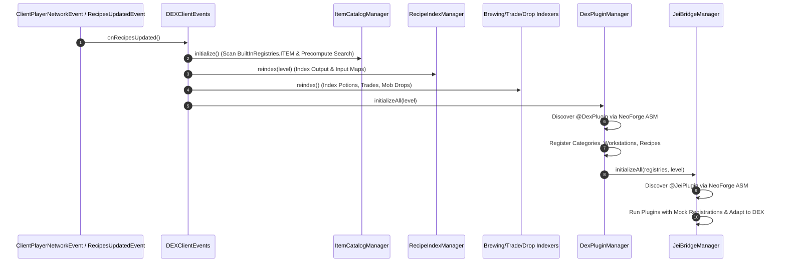
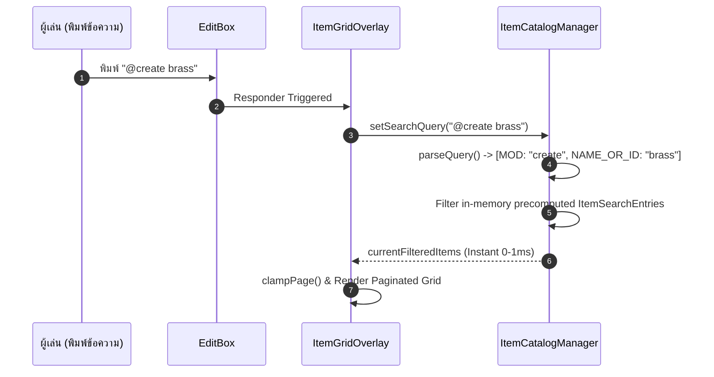

# DEX Mod Architecture Specification
**เวอร์ชัน:** 1.0.0+1.21.1 | **Mod Loader:** NeoForge 21.1.x | **Java Version:** 21

เอกสารนี้ระบุโครงสร้างสถาปัตยกรรม การออกแบบเชิงซอฟต์แวร์ (Software Architecture) และผังการทำงานของม็อด **DEX** (Item & Recipe Viewer with Mod Origin Categorization) ไว้อย่างละเอียดสำหรับผู้พัฒนา

---

## 1. ภาพรวมสถาปัตยกรรม (System Overview)

DEX ถูกออกแบบตามหลักการ **Decoupled Layered Architecture** แยกเลเยอร์การประมวลผลข้อมูล (Data Layer), เลเยอร์การแสดงผล (Presentation Layer), เลเยอร์การเชื่อมต่อภายนอก (API & Bridge Layer) ออกจากกันอย่างอิสระ เพื่อให้ประสิทธิภาพการทำงานสูง กินทรัพยากรเครื่องน้อย และรองรับการขยายตัวได้ง่าย

```mermaid
graph TD
    subgraph Minecraft [Minecraft & NeoForge Runtime]
        MCLevel[ClientLevel & Registries]
        ContainerScreen[AbstractContainerScreen]
        ScanData[ModFileScanData ASM]
    end

    subgraph DataLayer [Data & Indexing Layer]
        Catalog[ItemCatalogManager<br/>Precomputed Search Cache]
        RecipeIndex[RecipeIndexManager<br/>O1 Output & Input Maps]
        SubManagers[Brewing / Trading / Drops Managers]
        TreeCalc[CraftingTreeCalculator<br/>Recursive Decomposition]
    end

    subgraph CompatibilityLayer [API & Compatibility Layer]
        DexAPI[com.dex.api<br/>@DexPlugin / Registries]
        DexPluginMgr[DexPluginManager<br/>ASM Scanner]
        JeiBridge[com.dex.compat.jei<br/>Fake JEI Host & Dynamic Proxies]
    end

    subgraph PresentationLayer [UI & Interaction Layer]
        Events[DEXClientEvents<br/>Lifecycle & Input Hooks]
        Sidebar[ModSidebarWidget<br/>Mod Origin Selector]
        Grid[ItemGridOverlay<br/>JEI-Style Side Overlay]
        RecipeScreen[RecipeViewerScreen<br/>Recipes / Tree / Usages]
    end

    MCLevel -->|Item Registry| Catalog
    MCLevel -->|RecipeManager| RecipeIndex
    MCLevel -->|Brewing & Trades| SubManagers

    ScanData -->|Discover @DexPlugin| DexPluginMgr
    ScanData -->|Discover @JeiPlugin| JeiBridge

    DexPluginMgr --> DexAPI
    JeiBridge --> DexAPI

    RecipeIndex --> TreeCalc

    Events -->|Calculate Bounds| Sidebar
    Events -->|Forward Mouse/Keys| Grid
    ContainerScreen --> Events

    Catalog --> Grid
    RecipeIndex --> RecipeScreen
    SubManagers --> RecipeScreen
    TreeCalc --> RecipeScreen
    DexAPI --> RecipeScreen
```

---

## 2. โครงสร้างแพ็กเกจ (Package Responsibilities)

```
c:/Users/vivo9/Desktop/Minecraft my mod/dex-neoforge-1.21.1/src/main/java/com/dex/
├── DEXMod.java                               # Entry point หลักของ Mod
├── catalog/                                  # จัดการแคตตาล็อกและ Search Engine
│   ├── ItemCatalogManager.java               # ศูนย์กลางจัดการรายการไอเทมและระบบค้นหา
│   └── ModInfo.java                          # โมเดลข้อมูลของแต่ละ Mod
├── recipe/                                   # ระบบจัดทำดัชนีสูตรคราฟต์
│   ├── RecipeIndexManager.java               # Indexer สูตรมาตรฐาน O(1) Lookup
│   ├── tree/                                 # เครื่องคำนวณแตกกิ่งวัตถุดิบ
│   │   ├── CraftingTreeCalculator.java       # เอนจินคำนวณ Recursive Tree
│   │   └── CraftingTreeNode.java             # Node โครงสร้างต้นไม้วัตถุดิบ
│   ├── brewing/                              # Indexer แท่นปรุงยา (Brewing Stand)
│   ├── trading/                              # Indexer แลกเปลี่ยนชาวบ้าน (Villager Trades)
│   └── drops/                                # Indexer แหล่งดรอปมอนสเตอร์ (Mob Drops)
├── client/                                   # การทำงานฝั่ง Client และ UI
│   ├── DEXClient.java                        # Client Registration
│   ├── DEXClientEvents.java                  # Event Hooks (Screen, Mouse, Keys, Bounds, Slot Shortcuts)
│   ├── bookmark/
│   │   └── BookmarkManager.java              # ระบบบุ๊กมาร์ก/ปักหมุดไอเทม บันทึก JSON อัตโนมัติ
│   └── gui/
│       ├── overlay/                          # หน้าต่าง Overlay ด้านข้าง Inventory
│       │   ├── ModSidebarWidget.java         # แถบเลือก Mod ต้นทาง และแท็บ Bookmark ★
│       │   └── ItemGridOverlay.java          # ตารางไอเทม ตราดาวทอง และ Search Box
│       └── recipe/                           # หน้าต่าง Popup สูตรคราฟต์
│           └── RecipeViewerScreen.java       # Multi-Tab Recipe, Dynamic Machine Tabs & History GUI
├── api/                                      # Public API ให้ม็อดอื่นต่อยอด
│   ├── DexPlugin.java                        # @DexPlugin Annotation
│   ├── DexRecipeSlot.java                    # โมเดลพิกัดสล็อตและไอเทมในสูตรคราฟต์
│   ├── IDexPlugin.java                       # Interface หลักของ Plugin
│   ├── IDexRecipeCategory.java               # ข้อกำหนดหมวดหมู่สูตร/เครื่องจักร
│   ├── IDexCategoryRegistry.java             # รีจิสทรีสำหรับหมวดหมู่
│   ├── IDexWorkstationRegistry.java          # รีจิสทรีสำหรับบล็อกเครื่องจักร
│   └── IDexRecipeRegistry.java               # รีจิสทรีสำหรับสูตรคราฟต์
├── plugin/                                   # ตัวควบคุมการโหลด Plugin ภายใน
│   ├── DexPluginManager.java                 # สแกนและเริ่มวงจร Plugin
│   ├── DexRegistriesImpl.java                # Central Thread-Safe Registry Storage
│   └── vanilla/
│       └── VanillaDexPlugin.java             # Plugin มาตรฐานของ Vanilla Recipes
└── compat/
    └── jei/                                  # สะพานเชื่อมต่อม็อดที่รองรับ JEI
        ├── JeiBridgeManager.java             # ตัวสแกนและประสานงาน JEI Plugin
        ├── JeiProxyHelper.java               # Dynamic Proxies ป้องกัน Crash
        ├── MockJeiRegistrations.java         # จำลอง Environment ของ JEI
        ├── MockRecipeLayoutBuilder.java      # ดักจับพิกัดช่องและไอเทมในสูตร
        └── JeiCategoryAdapter.java           # แปลง IRecipeCategory เข้า DEX
```

---

## 3. เจาะลึกการทำงานของแต่ละระบบหลัก (Core Subsystems)

### 3.1 ระบบ Search Engine & Precomputed Item Catalog
* **ไฟล์หลัก:** [`ItemCatalogManager.java`](file:///c:/Users/vivo9/Desktop/Minecraft%20my%20mod/dex-neoforge-1.21.1/src/main/java/com/dex/catalog/ItemCatalogManager.java)
* **กลไกความเร็วสูง (High-Performance In-Memory Cache):**
  - ตอนเริ่มเกม ระบบจะดึงไอเทมจาก `BuiltInRegistries.ITEM` และแปลงเป็น `ItemSearchEntry` แคชไว้ล่วงหน้า
  - แคชล่วงหน้า: `lowerName`, `lowerId`, `lowerModId`, `lowerModName`, และ `lowerTags`
  - การพิมพ์ค้นหาขณะเล่นเกมจะทำงานกับ String / Set ใน RAM เท่านั้น จึงไม่มีการเรียก `stack.getHoverName()` ซ้ำ ทำให้เฟรมเรตนิ่ง 60-144 FPS
* **Multi-Token Query & Relevance Scoring Engine:**
  - รองรับการค้นหาแบบผสมคำด้วย Space (AND Logic)
  - `@mod` : ค้นหาตาม Mod ID หรือ Display Name (เช่น `@create`, `@minecraft`)
  - `#tag` : ค้นหาตาม Item Tag (เช่น `#c:ingots`, `#ores`)
  - `$tooltip` : ค้นหาลึกถึงข้อความคำอธิบาย Tooltip (เช่น `$energy`, `$durability`)
  - `-neg` : Negative Exclusion คัดกรองสิ่งที่ไม่ต้องการออก (เช่น `iron -ingot`)
  - `"..."` : Exact Phrase (เช่น `"raw iron"`)
  - **Relevance Scoring:** จัดเรียงผลลัพธ์ตามระดับความตรงประเด็น (Exact Name +10,000 > Prefix +5,000 > Word Boundary +2,500 > Contains +1,000 > ID/Tag/Tooltip +400) เพื่อให้ไอเทมหลัก (เช่น `Iron Ingot`) ปรากฏก่อนเครื่องมือเสมอ

### 3.2 Recipe Indexing, Custom Categories & Decomposition Engine
* **ไฟล์หลัก:** [`RecipeIndexManager.java`](file:///c:/Users/vivo9/Desktop/Minecraft%20my%20mod/dex-neoforge-1.21.1/src/main/java/com/dex/recipe/RecipeIndexManager.java) & [`CraftingTreeCalculator.java`](file:///c:/Users/vivo9/Desktop/Minecraft%20my%20mod/dex-neoforge-1.21.1/src/main/java/com/dex/recipe/tree/CraftingTreeCalculator.java)
* **O(1) Recipe Lookup & Machine Integration:**
  - จัดทำ Reverse Index `Map<Item, List<RecipeHolder<?>>>`:
    - `recipesByOutput`: หาว่าไอเทมนี้คราฟต์อย่างไร (Recipes - ปุ่ม `R`)
    - `recipesByInput`: หาว่าไอเทมนี้เอาไปทำอะไรต่อได้ (Usages - ปุ่ม `U`)
  - เชื่อมต่อกับหมวดหมู่เครื่องจักรจาก [DexRegistriesImpl](file:///c:/Users/vivo9/Desktop/Minecraft%20my%20mod/dex-neoforge-1.21.1/src/main/java/com/dex/plugin/DexRegistriesImpl.java) แสดงสูตรของม็อดเทคโนโลยี/เวทมนตร์ต่างๆ ผ่านแท็บไดนามิกอัตโนมัติ
* **Crafting Tree Calculator (Raw Material Decomposition):**
  - แตกกิ่งแบบ Recursive ลงไปจนถึงวัตถุดิบตั้งต้น (Base Materials)
  - มีระบบ **Cycle Detection** จำกัดความลึกที่ `MAX_DEPTH = 6` และตรวจสอบ Ancestor Branch Path ป้องกัน Infinite Recursion ในสูตรแปลงวนไปมา (เช่น Iron Block <-> Iron Ingot)
  - สรุปผลรวมวัตถุดิบตั้งต้นทั้งหมด (Total Raw Materials) พร้อมปุ่มคูณจำนวน `[x1] [x4] [x16] [x64]`

### 3.3 Client Overlay, Bookmarks & Interaction Layer
* **ไฟล์หลัก:** [`DEXClientEvents.java`](file:///c:/Users/vivo9/Desktop/Minecraft%20my%20mod/dex-neoforge-1.21.1/src/main/java/com/dex/client/DEXClientEvents.java), [`ItemGridOverlay.java`](file:///c:/Users/vivo9/Desktop/Minecraft%20my%20mod/dex-neoforge-1.21.1/src/main/java/com/dex/client/gui/overlay/ItemGridOverlay.java), [`BookmarkManager.java`](file:///c:/Users/vivo9/Desktop/Minecraft%20my%20mod/dex-neoforge-1.21.1/src/main/java/com/dex/client/bookmark/BookmarkManager.java)
* **Dynamic Right-Anchored Bounds:**
  - ดักจับ Event `ScreenEvent.Render.Post` บน `AbstractContainerScreen`
  - คำนวณขอบขวาของกล่อง/โต๊ะคราฟต์ทุกเฟรม:
    `containerRight = Math.max(container.getGuiLeft() + container.getXSize(), (screenWidth + 176) / 2) + 6;`
  - ล็อกตำแหน่งแถบ Mod Sidebar และ Item Grid ให้อยู่ทางขวาสุดของจอ **ไม่ทับซ้อนกับหน้าต่าง Inventory ของผู้เล่นเด็ดขาด**
* **Container Slot Hotkey Hooks & Tooltip Hints:**
  - สามารถชี้เมาส์ที่ไอเทมในตัวผู้เล่น, ในหีบ หรือในตารางสูตร แล้วกด:
    - `R` : ดูสูตรการสร้าง (Recipes)
    - `U` : ดูการนำไปใช้งาน (Usages)
    - `A` : ปักหมุด / ถอนปักหมุดไอเทมที่ชื่นชอบ (Bookmark)
  - ระบบ Tooltip แสดงแหล่งที่มาของม็อดตัวเอียงสีฟ้า (`Origin: <Mod>`) และปุ่มลัดชัดเจน
* **Bookmark & Favorites System:**
  - จัดเก็บรายการโปรดเป็น JSON อัตโนมัติที่ `config/dex_bookmarks.json`
  - แท็บพิเศษ `★ Bookmarks` ด้านบนสุดของ Sidebar รวบรวมไอเทมที่ปักหมุดไว้
  - แสดงตราดาวสีทองมุมขวาล่างของช่องไอเทมที่ปักหมุด
* **Recipe Viewer History & Navigation:**
  - จดจำเส้นทางการเปิดสูตรด้วย Navigation Stack สามารถกด `Backspace` หรือปุ่ม `[ ⮌ Back ]` เพื่อย้อนกลับไปสูตรก่อนหน้าได้ไม่จำกัดขั้นตอน
* **Focus & Key Event Management:**
  - Search Box ดักจับคีย์บอร์ดโดยตรง (`keyPressed` & `charTyped`) ขณะที่โฟกัสอยู่ เพื่อป้องกันไม่ให้ปุ่ม `E` หรือ `Q` ปิดหน้าต่าง Inventory
  - กด `ESC` เพื่อ Unfocus และคลิกขวาที่ช่องค้นหาเพื่อเคลียร์ข้อความทันที
  - ปุ่ม `Ctrl + O` สลับการเปิด/ปิด Overlay

### 3.4 DEX Plugin Architecture (`com.dex.api`)
* **ไฟล์หลัก:** [`DexPlugin.java`](file:///c:/Users/vivo9/Desktop/Minecraft%20my%20mod/dex-neoforge-1.21.1/src/main/java/com/dex/api/DexPlugin.java) & [`DexPluginManager.java`](file:///c:/Users/vivo9/Desktop/Minecraft%20my%20mod/dex-neoforge-1.21.1/src/main/java/com/dex/plugin/DexPluginManager.java)
* **Lazy Discovery ผ่าน ASM:**
  - ใช้ `ModList.get().getAllScanData()` ตรวจหา Annotation `@DexPlugin` จากไฟล์ Mod โดยไม่ต้อง Force Load คลาสล่วงหน้า ช่วยประหยัดเวลาและ RAM ตอนเปิดเกม
* **3-Stage Lifecycle:**
  1. `registerCategories(IDexCategoryRegistry)`: ลงทะเบียนหมวดหมู่เครื่องจักร
  2. `registerWorkstations(IDexWorkstationRegistry)`: จับคู่บล็อกเครื่องจักรกับหมวดหมู่
  3. `registerRecipes(IDexRecipeRegistry, ClientLevel)`: ส่งรายการสูตรเข้าสู่ระบบ

### 3.5 DEX - JEI Compatibility Bridge (`com.dex.compat.jei`)
* **ไฟล์หลัก:** [`JeiBridgeManager.java`](file:///c:/Users/vivo9/Desktop/Minecraft%20my%20mod/dex-neoforge-1.21.1/src/main/java/com/dex/compat/jei/JeiBridgeManager.java) & [`JeiProxyHelper.java`](file:///c:/Users/vivo9/Desktop/Minecraft%20my%20mod/dex-neoforge-1.21.1/src/main/java/com/dex/compat/jei/JeiProxyHelper.java)
* **The Fake JEI Host Pattern:**
  - สแกนหาคลาสที่มี `@mezz.jei.api.JeiPlugin` จากม็อดภายนอกทั้งหมดที่ติดตั้งในเครื่อง (เช่น Create, Mekanism, Thermal, Farmer's Delight)
  - จำลอง Environment และส่ง Mock Registration Objects (`IRecipeCategoryRegistration`, `IRecipeCatalystRegistration`, `IRecipeRegistration`, `IRecipeLayoutBuilder`) ให้ Plugin ภายนอกทำงาน
  - ดักจับข้อมูลสูตร, บล็อกเครื่องจักร, และพิกัดสล็อต แล้วแปลงเข้าสู่ [DexRegistriesImpl](file:///c:/Users/vivo9/Desktop/Minecraft%20my%20mod/dex-neoforge-1.21.1/src/main/java/com/dex/plugin/DexRegistriesImpl.java) ทันที
* **Crash Prevention via Dynamic Proxies:**
  - ใช้ `java.lang.reflect.Proxy` จำลอง `IJeiHelpers`, `IGuiHelper`, `IDrawable` คืนค่าปลอดภัย ป้องกันไม่ให้ Plugin ใดโยน `NullPointerException` หรือแครชเกม

---

## 4. ผังการไหลของข้อมูล (Data Flows)

### 4.1 การโหลดข้อมูลตอนเริ่มเกมและเข้าสู่โลก (Initialization Pipeline)



### 4.2 วงจรการค้นหาไอเทม (Search & Filter Pipeline)



---

## 5. การวิเคราะห์ความซับซ้อนและประสิทธิภาพ (Performance & Complexity)

| การทำงาน | Time Complexity | Space Complexity | หมายเหตุ |
|---|---|---|---|
| **Recipe Lookup by Output (`R`)** | $O(1)$ | $O(R)$ | ดึงจาก Hash Map โดยตรง |
| **Recipe Lookup by Usage (`U`)** | $O(1)$ | $O(R \cdot I)$ | ดึงจาก Reverse Ingredient Map โดยตรง |
| **Search Filtering** | $O(N \cdot T)$ | $O(1)$ เพิ่มเติม | $N$ = จำนวนไอเทม (~5k-20k), $T$ = จำนวน Search Tokens (1-3 tokens) ทำงานบน String ใน RAM ไร้การ Allocations |
| **Crafting Tree Calculation** | $O(B^D)$ | $O(D)$ | $B$ = กิ่งวัตถุดิบ (~1-4), $D$ = Depth สูงสุด 6 พร้อม Cycle Check |
| **JEI Plugin Discovery** | $O(M)$ | $O(P)$ | $M$ = จำนวน Mod Scan Data, $P$ = จำนวน Plugins สแกนระดับ Bytecode Metadata ไม่ต้องโหลด Class |

---

## 6. ข้อกำหนดการต่อยอด (Extension Guidelines)

1. **สำหรับผู้พัฒนาม็อดภายนอก:**
   - ศึกษาวิธีเชื่อมต่อผ่าน [`docs/DEX_API_GUIDE.md`](file:///c:/Users/vivo9/Desktop/Minecraft%20my%20mod/dex-neoforge-1.21.1/docs/DEX_API_GUIDE.md)
   - ใช้งาน `@DexPlugin` และ implement `IDexPlugin`
2. **หากต้องการเพิ่มหมวดหมู่สูตรใหม่ใน DEX:**
   - Implement `IDexRecipeCategory<T>`
   - ลงทะเบียนผ่าน `DexPluginManager.getInstance().getRegistries().registerCategory(...)`
