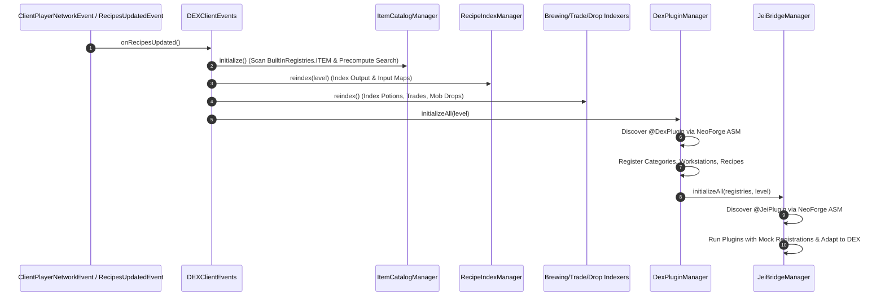
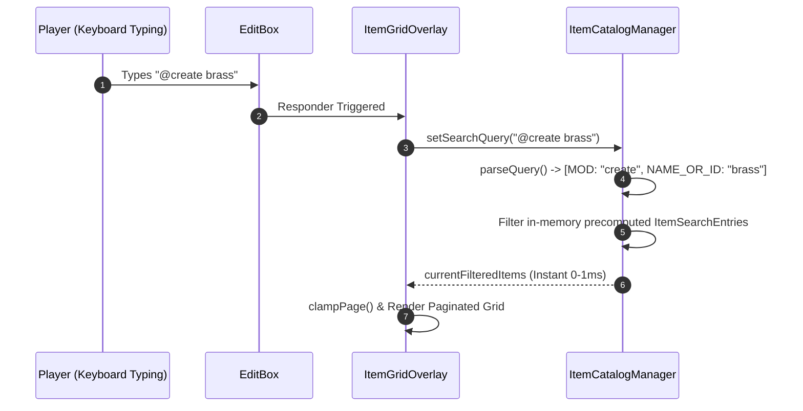

# DEX Mod Architecture Specification
**Version:** 1.0.0+1.21.1 | **Mod Loader:** NeoForge 21.1.x | **Java Version:** 21

This document provides a detailed technical overview of the software architecture, design patterns, and runtime workflows for the **DEX** Minecraft mod (Item & Recipe Viewer with Mod Origin Categorization).

---

## 1. System Overview

DEX is designed following a **Decoupled Layered Architecture**, strictly separating data processing, UI rendering, and external plugin/mod integration. This ensures high rendering throughput (60–144 FPS), minimal memory overhead, and seamless modularity.

```mermaid
graph TD
    subgraph Minecraft [Minecraft & NeoForge Runtime]
        MCLevel[ClientLevel & Registries]
        ContainerScreen[AbstractContainerScreen]
        ScanData[ModFileScanData ASM]
    end

    subgraph DataLayer [Data & Indexing Layer]
        Catalog[ItemCatalogManager<br/>Precomputed Search Cache]
        RecipeIndex[RecipeIndexManager<br/>O1 Output & Input Maps]
        SubManagers[Brewing / Trading / Drops Managers]
        TreeCalc[CraftingTreeCalculator<br/>Recursive Decomposition]
    end

    subgraph CompatibilityLayer [API & Compatibility Layer]
        DexAPI[com.dex.api<br/>@DexPlugin / Registries]
        DexPluginMgr[DexPluginManager<br/>ASM Scanner]
        JeiBridge[com.dex.compat.jei<br/>Fake JEI Host & Dynamic Proxies]
    end

    subgraph PresentationLayer [UI & Interaction Layer]
        Events[DEXClientEvents<br/>Lifecycle & Input Hooks]
        Sidebar[ModSidebarWidget<br/>Mod Origin Selector]
        Grid[ItemGridOverlay<br/>JEI-Style Side Overlay]
        RecipeScreen[RecipeViewerScreen<br/>Recipes / Tree / Usages]
    end

    MCLevel -->|Item Registry| Catalog
    MCLevel -->|RecipeManager| RecipeIndex
    MCLevel -->|Brewing & Trades| SubManagers

    ScanData -->|Discover @DexPlugin| DexPluginMgr
    ScanData -->|Discover @JeiPlugin| JeiBridge

    DexPluginMgr --> DexAPI
    JeiBridge --> DexAPI

    RecipeIndex --> TreeCalc

    Events -->|Calculate Bounds| Sidebar
    Events -->|Forward Mouse/Keys| Grid
    ContainerScreen --> Events

    Catalog --> Grid
    RecipeIndex --> RecipeScreen
    SubManagers --> RecipeScreen
    TreeCalc --> RecipeScreen
    DexAPI --> RecipeScreen
```

---

## 2. Package Structure & Responsibilities

```
c:/Users/vivo9/Desktop/Minecraft my mod/dex-neoforge-1.21.1/src/main/java/com/dex/
├── DEXMod.java                               # Main Mod Entry Point & Logger
├── catalog/                                  # Catalog & Search Engine
│   ├── ItemCatalogManager.java               # Central catalog & precomputed search engine
│   └── ModInfo.java                          # Mod metadata model (name, ID, icon, items)
├── recipe/                                   # Recipe Indexing & Lookup
│   ├── RecipeIndexManager.java               # O(1) Reverse Recipe Indexer (Output/Input maps)
│   ├── RecipeIngredientHelper.java           # Universal ingredient extractor & workstation classifier
│   ├── tree/                                 # Raw Material Calculator
│   │   ├── CraftingTreeCalculator.java       # Recursive decomposition engine
│   │   └── CraftingTreeNode.java             # Tree data structure
│   ├── brewing/                              # Potion brewing indexer
│   ├── trading/                              # Villager & wandering trader indexer
│   └── drops/                                # Mob drop mapping indexer
├── client/                                   # Client-side lifecycle & UI
│   ├── DEXClient.java                        # Client registration setup
│   ├── DEXClientEvents.java                  # Event bus hooks (screen render, input, bounds)
│   ├── bookmark/
│   │   └── BookmarkManager.java              # Pinned favorites manager & JSON persistence
│   └── gui/
│       ├── overlay/                          # In-game container side overlays
│       │   ├── ModSidebarWidget.java         # Mod origin vertical selector
│       │   └── ItemGridOverlay.java          # Paginated item grid & search input box
│       └── recipe/                           # Recipe viewing screens
│           └── RecipeViewerScreen.java       # Multi-tab recipe popup, tree & history GUI
├── api/                                      # Public API for third-party mods
│   ├── DexPlugin.java                        # @DexPlugin class-level annotation
│   ├── DexRecipeSlot.java                    # Relative slot position & items model
│   ├── IDexPlugin.java                       # Main plugin contract
│   ├── IDexRecipeCategory.java               # Custom recipe category / machine GUI spec
│   ├── IDexCategoryRegistry.java             # Category registration interface
│   ├── IDexWorkstationRegistry.java          # Workstation / catalyst mapping interface
│   └── IDexRecipeRegistry.java               # Custom recipe registration interface
├── plugin/                                   # Internal plugin management
│   ├── DexPluginManager.java                 # ASM scanner & lifecycle coordinator
│   ├── DexRegistriesImpl.java                # Central thread-safe registry storage
│   └── vanilla/
│       └── VanillaDexPlugin.java             # Default plugin registering vanilla categories
└── compat/
    └── jei/                                  # JEI Compatibility Bridge
        ├── JeiBridgeManager.java             # JEI plugin scanner & execution host
        ├── JeiProxyHelper.java               # Dynamic proxies for crash-free GUI simulation
        ├── MockJeiRegistrations.java         # Mock JEI registration hosts
        ├── MockRecipeLayoutBuilder.java      # Slot position & ingredient capturer
        └── JeiCategoryAdapter.java           # Adapts IRecipeCategory to IDexRecipeCategory
```

---

## 3. Deep Dive into Core Subsystems

### 3.1 Catalog & High-Performance Search Engine
* **Core File:** [`ItemCatalogManager.java`](file:///c:/Users/vivo9/Desktop/Minecraft%20my%20mod/dex-neoforge-1.21.1/src/main/java/com/dex/catalog/ItemCatalogManager.java)
* **Precomputed In-Memory Search Cache (`ItemSearchEntry`):**
  - Items are indexed once on startup from `BuiltInRegistries.ITEM`.
  - Display names, resource paths, mod IDs, mod display names, and tag identifiers are normalized to lowercase strings and cached in RAM.
  - No `Component` or registry queries occur during live typing, ensuring instantaneous search response (< 1ms) even across 20,000+ items.
* **Multi-Token Query Engine (AND Logic):**
  - Space-delimited queries are tokenized and evaluated simultaneously:
    - `@mod` : Filter by Mod ID or display name (e.g. `@create`, `@minecraft`).
    - `#tag` : Filter by TagKey paths (e.g. `#c:ingots`, `#ores`).
    - `-neg` : Negative exclusion prefix (e.g. `iron -ingot` returns iron gear, armor, blocks, excluding ingots).
    - `"..."` : Exact quoted phrase matching (e.g. `"raw iron"`).

### 3.2 Recipe Indexing & Decomposition Engine
* **Core Files:** [`RecipeIndexManager.java`](file:///c:/Users/vivo9/Desktop/Minecraft%20my%20mod/dex-neoforge-1.21.1/src/main/java/com/dex/recipe/RecipeIndexManager.java) & [`CraftingTreeCalculator.java`](file:///c:/Users/vivo9/Desktop/Minecraft%20my%20mod/dex-neoforge-1.21.1/src/main/java/com/dex/recipe/tree/CraftingTreeCalculator.java)
* **O(1) Recipe Lookup Maps:**
  - `recipesByOutput`: Direct map from `Item` to recipes that produce it (Recipes query / `R` key).
  - `recipesByInput`: Reverse map from `Item` to recipes that consume it (Usages query / `U` key).
* **Crafting Tree Calculator (Raw Material Decomposition):**
  - Recursively decomposes craftable items down to raw/base materials.
  - **Cycle Detection:** Bounded at `MAX_DEPTH = 6` with branch-scoped ancestor tracking (`new HashSet<>(visited)`) to prevent cyclic loops (e.g. Iron Block <-> Iron Ingot) without suppressing parallel sister branches.
  - Aggregates a **Total Raw Materials** breakdown with quantity scaling buttons `[x1] [x4] [x16] [x64]`.

### 3.3 Client Overlay & Interaction Layer
* **Core Files:** [`DEXClientEvents.java`](file:///c:/Users/vivo9/Desktop/Minecraft%20my%20mod/dex-neoforge-1.21.1/src/main/java/com/dex/client/DEXClientEvents.java) & [`ItemGridOverlay.java`](file:///c:/Users/vivo9/Desktop/Minecraft%20my%20mod/dex-neoforge-1.21.1/src/main/java/com/dex/client/gui/overlay/ItemGridOverlay.java)
* **Dynamic Right-Anchored Layout:**
  - Listens to `ScreenEvent.Render.Post` on all `AbstractContainerScreen` instances.
  - Dynamically recalculates the actual right boundary of the open container:
    `containerRight = Math.max(container.getGuiLeft() + container.getXSize(), (screenWidth + 176) / 2) + 6;`
  - Pins the Mod Sidebar and Item Grid to the remaining screen space to the right, **guaranteeing zero visual overlap with the player's inventory or crafting grid**.
* **Focus & Key Event Routing:**
  - When the search box is active, it consumes all printable keys (`keyPressed` and `charTyped`), preventing `E` or `Q` from closing the container or dropping items.
  - Pressing `ESC` releases search focus before closing the container.
  - Right-clicking the search box instantly clears text.
  - Global toggle hotkey: `Ctrl + O` hides or reveals the DEX overlay.

### 3.4 DEX Plugin Architecture (`com.dex.api`)
* **Core Files:** [`DexPlugin.java`](file:///c:/Users/vivo9/Desktop/Minecraft%20my%20mod/dex-neoforge-1.21.1/src/main/java/com/dex/api/DexPlugin.java) & [`DexPluginManager.java`](file:///c:/Users/vivo9/Desktop/Minecraft%20my%20mod/dex-neoforge-1.21.1/src/main/java/com/dex/plugin/DexPluginManager.java)
* **Lazy Bytecode Scanning:**
  - Uses NeoForge's `ModList.get().getAllScanData()` to locate classes with `@DexPlugin` annotations at the ASM bytecode level without eagerly initializing classes.
* **3-Phase Lifecycle:**
  1. `registerCategories(IDexCategoryRegistry)`: Defines custom workstations / recipe tabs.
  2. `registerWorkstations(IDexWorkstationRegistry)`: Associates blocks/items with category IDs.
  3. `registerRecipes(IDexRecipeRegistry, ClientLevel)`: Supplies custom machine recipe entries.

### 3.5 DEX - JEI Compatibility Bridge (`com.dex.compat.jei`)
* **Core Files:** [`JeiBridgeManager.java`](file:///c:/Users/vivo9/Desktop/Minecraft%20my%20mod/dex-neoforge-1.21.1/src/main/java/com/dex/compat/jei/JeiBridgeManager.java) & [`JeiProxyHelper.java`](file:///c:/Users/vivo9/Desktop/Minecraft%20my%20mod/dex-neoforge-1.21.1/src/main/java/com/dex/compat/jei/JeiProxyHelper.java)
* **The "Fake JEI Host" Pattern:**
  - Automatically identifies all mods in the game containing `@mezz.jei.api.JeiPlugin` annotations (e.g. Create, Mekanism, Thermal, Botania, Farmer's Delight).
  - Instantiates their `IModPlugin` classes and supplies them with DEX's mock registration objects (`IRecipeCategoryRegistration`, `IRecipeCatalystRegistration`, `IRecipeRegistration`, `IRecipeLayoutBuilder`).
  - Third-party mods feed their custom categories, catalysts, and recipes into DEX without requiring any explicit DEX integration.
* **Crash-Proof Dynamic Proxies:**
  - Uses `java.lang.reflect.Proxy` to simulate `IJeiHelpers`, `IGuiHelper`, and `IDrawable` objects with safe fallback return values, completely preventing `NullPointerException`s when third-party plugins access JEI graphical utilities.

---

## 4. Runtime Data Flows

### 4.1 Initialization & Indexing Pipeline



### 4.2 Search & Filtering Pipeline



---

## 5. Performance & Complexity Analysis

| Operation | Time Complexity | Space Complexity | Notes |
|---|---|---|---|
| **Recipe Lookup by Output (`R`)** | $O(1)$ | $O(R)$ | Direct hash lookup from output item map |
| **Recipe Lookup by Usage (`U`)** | $O(1)$ | $O(R \cdot I)$ | Direct hash lookup from reverse ingredient map |
| **Search Filtering** | $O(N \cdot T)$ | $O(1)$ additional | $N$ = total items (~5k–20k), $T$ = tokens (1–3); zero allocations during typing |
| **Crafting Tree Decomposition** | $O(B^D)$ | $O(D)$ | $B$ = ingredients per recipe (~1–4), $D$ = depth (max 6) with cycle pruning |
| **Plugin ASM Discovery** | $O(M)$ | $O(P)$ | $M$ = mod scan entries, $P$ = discovered plugins; inspects bytecode metadata without loading classes |

---

## 6. Developer Guidelines

1. **For External Mod Developers:**
   - Refer to the integration guide at [`docs/DEX_API_GUIDE.md`](file:///c:/Users/vivo9/Desktop/Minecraft%20my%20mod/dex-neoforge-1.21.1/docs/DEX_API_GUIDE.md).
   - Use `@DexPlugin` and implement `IDexPlugin`.
2. **Adding Custom Recipe Categories inside DEX:**
   - Implement `IDexRecipeCategory<T>`.
   - Register via `DexPluginManager.getInstance().getRegistries().registerCategory(...)`.
